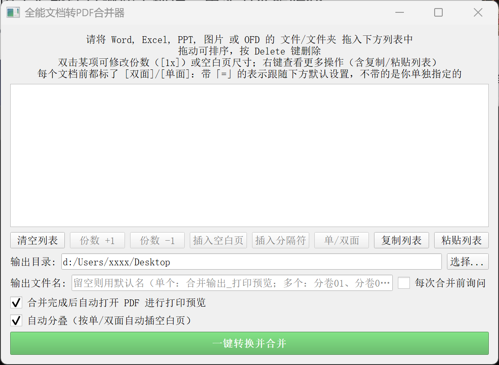

# 全能文档转PDF合并器

一款简单易用的桌面工具，支持将 Word、Excel、图片、OFD 等多种格式文件**拖拽排序**并**一键合并**为一个 PDF 文件，方便打印或存档。

## ✨ 功能特点

*   **多格式支持**：支持 `.doc`/`.docx`, `.xls`/`.xlsx`, `.jpg`/`.png`/`.bmp` 图片, `.ofd` (电子发票等), 以及直接合并 `.pdf`。
*   **拖拽操作**：文件支持拖拽添加，并可在列表内通过拖拽自由调整合并顺序。
*   **智能转换**：
    *   **Office 文件**：自动适配 Microsoft Office 或 WPS Office 进行转换。
    *   **OFD 文件**：采用社区优化版 `easyofd` 库，转换更稳定（**建议使用**，规避官方版潜在 bug）。
*   **灵活输出**：可自定义 PDF 输出目录与文件名，并选择转换后是否自动打开文件进行打印预览。
*   **重复份数**：同一个文件可以在输出里重复出现多次（例如「A 卷打 2 份」）。
*   **空白页 / 分隔符**：可在任意位置插入指定尺寸的空白页；用「分隔符」把列表切成多个独立 PDF，并支持给每一段单独命名。
*   **单面 / 双面自动分叠**：给每个文件标记「单面」或「双面」，程序自动插入空白页 —— 打印时全程只选「双面」，单面文档的背面会自动空出来，相邻文档也不会挤在同一张纸的两面。
*   **列表可复制粘贴**：整个列表（含份数、面向、分隔符等设置）可导出成 JSON 保存，之后原样恢复。

## 🖼️ 界面预览



## 🤖 命令行 / Agent 调用

除图形界面外，还提供命令行入口 `pdf_merger_cli.py`。转换与合并的核心逻辑和界面版**完全共用**，因此同样的输入会得到完全一致的 PDF。

```bash
# 几个文件按默认（双面）合并成一个 PDF
python pdf_merger_cli.py -i 试卷.docx -i 答案.pdf -o D:\out

# 其中某个文件要单面打印（每页独占一张纸，背面留白）
python pdf_merger_cli.py -i 试卷.pdf -i "[1x] [单面] 答案.pdf" -o D:\out

# 复用界面里「复制列表」保存的 JSON 配置
python pdf_merger_cli.py --list-file list.json -o D:\out

# 机器可读输出，便于脚本 / Agent 解析
python pdf_merger_cli.py --list-file list.json -o D:\out --json

# 先看看会怎么处理，不实际生成
python pdf_merger_cli.py --list-file list.json --dry-run
```

常用参数：

| 参数 | 说明 |
| --- | --- |
| `-i, --input VALUE` | 输入项，可重复。既可以是纯文件路径，也可以是列表项文本，如 `"[2x] [单面] D:\a.pdf"` |
| `-o, --out-dir DIR` | 输出目录（默认当前目录，不存在会自动创建） |
| `-n, --name NAME` | 输出文件名（不含 `.pdf`）；多段时可用 `#` 作序号占位符 |
| `--list-file FILE` | 读取「复制列表」导出的 JSON 文件 |
| `--list JSON` / `--stdin` | 直接传入 JSON 字符串 / 从标准输入读取 |
| `--no-auto-pad` | 关闭自动分叠（不插入空白页） |
| `--json` | 以 JSON 输出结果 |
| `--dry-run` | 只列出将要处理的内容，不实际转换 |
| `--example` | 打印一份 JSON 列表格式模板（覆盖全部语法，可直接复制修改） |
| `-q, --quiet` | 不输出进度信息 |

### 列表项语法

`-i` 的值、以及 JSON 里 `items` 的每一项，都支持这套写法：

| 写法 | 含义 |
| --- | --- |
| `<路径>` | 1 份、双面（默认） |
| `[2x] <路径>` | 重复 2 份 |
| `[1x] [单面] <路径>` | 单面：每页独占一张纸、背面留白 |
| `[1x] [双面] <路径>` | 双面 |
| `[空白页] A4纵向` | 插入一张空白页（也可写 `21x29.7`） |
| `[分隔符] 切分 名为 附件二` | 在此处拆成另一个 PDF 并命名为「附件二」 |
| `[分隔符] 插入分隔纸 21x29.7cm` | 插入一页纸作为物理隔断 |

### JSON 列表格式

`--list` / `--list-file` / `--stdin` 接受三种输入方式：

**1. 最简形式** —— 一个字符串数组，每项是路径或上面那种列表项文本：

```json
["a.docx", "[2x] b.pdf", "[1x] [单面] c.pdf"]
```

**2. 完整形式** —— 对象，可顺便指定输出文件名（与界面里「复制列表」导出的格式一致）：

```json
{
  "kind": "pdf_merger_list",
  "version": 1,
  "items": ["a.docx", "[空白页] A4纵向", "[1x] [单面] b.pdf"],
  "output_name": "合并结果"
}
```

其中 `kind` / `version` / `output_name` 都可省略，**只有 `items` 是必需的**；`kind` 若填写则必须等于 `"pdf_merger_list"`，否则会报错；`output_name` 等价于命令行的 `-n`（命令行给的 `-n` 优先级更高）。

**3. 纯文本** —— 每行一项，方便从记事本直接粘贴。

> ⚠️ **JSON 里的 Windows 路径**：反斜杠要写成两个，或者干脆改用正斜杠 ——
> `"D:\\a.pdf"` 或 `"D:/a.pdf"`。**单个 `\` 在 JSON 里是非法转义**，会解析失败。

拿不准格式时，直接运行 `python pdf_merger_cli.py --example`，会打印一份可直接复制修改的模板。

退出码：`0` 全部成功 ｜ `1` 用法或输入有误 ｜ `2` 部分成功（有文件被跳过）｜ `3` 失败（没有产出任何 PDF）。

完整参数说明见 `python pdf_merger_cli.py --help`。


## ⚠️ 注意事项

- **Office 依赖**：转换 Word 和 Excel 文件时，系统必须安装 **Microsoft Office** 或 **WPS Office**。
- **OFD 支持**：如需处理 OFD 文件，请确保按照上述要求正确安装 `easyofd` 库。另外easyofd可以考虑非官方社区版本 ([Ian-Jhon/easyofd](https://github.com/Ian-Jhon/easyofd))，修复了部分bug。